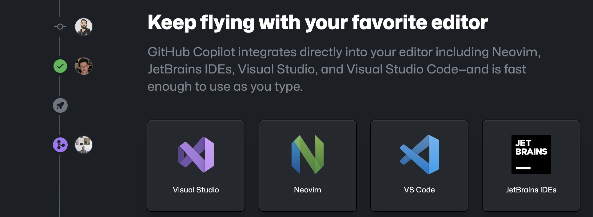
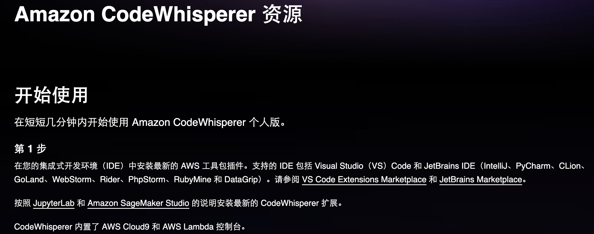

# IDEA Ultimate替换调研
IDEA Ultimate替换候选IDE：IDEA Community、VS Code

Eclipse生态过于老旧，较新的工具均不支持，因此淘汰：

# 典型应用开发工作流
- 新建工程
- 编写代码
- 调试测试 Debug/Profiling/UnitTest
- 代码仓库 Git/SVN
- 数据库管理
- Restful/gRPC接口测试

# IDEA Ultimate/Community、VS Code 对比
<table>
<tr><td>功能</td><td>IDEA Ultimate</td><td>IDEA Community</td><td>VS Code</td></tr>
<tr><td>价格</td><td>US $599/年</td><td>免费</td><td>免费</td></tr>
<tr><td>Java、Groovy、Kotlin、Scala</td><td>支持</td><td>支持</td><td>插件</td></tr>
<tr><td>XML、JSON、YAML、Markdown</td><td>支持</td><td>支持</td><td>插件</td></tr>
<tr><td>Python、Rust</td><td>支持</td><td>插件</td><td>插件</td></tr>
<tr><td>Go</td><td>支持</td><td>不支持</td><td>插件</td></tr>
<tr><td>JavaScript、TypeScript、CSS、Sass、SCSS、Less</td><td>支持</td><td>不支持</td><td>插件</td></tr>
<tr><td>Maven、Gradle、Ant</td><td>支持</td><td>支持</td><td>插件</td></tr>
<tr><td>Git、SVN</td><td>支持</td><td>支持</td><td>支持</td></tr>
<tr><td>Database Tools</td><td>支持</td><td>插件</td><td>插件</td></tr>
<tr><td>Restful Client</td><td>支持</td><td>Postman</td><td>插件</td></tr>
<tr><td>gRPC Client</td><td>Postman</td><td>Postman</td><td>插件</td></tr>
<tr><td>Debugger、Decompiler、Bytecode、UnitTest</td><td>支持</td><td>支持</td><td>支持</td></tr>
<tr><td>Profiling tools</td><td>支持</td><td>jVisualVM</td><td>插件</td></tr>
<tr><td>框架Spring*</td><td>支持</td><td>插件</td><td>插件</td></tr>
<tr><td>框架Micronaut, Quarkus, JPA</td><td>支持</td><td>插件</td><td>插件</td></tr>
<tr><td>模版Thymeleaf, Freemarker, Velocity</td><td>支持</td><td>不支持</td><td>插件</td></tr>
</table>

结论：
- IDEA Ultimate：开发体验最好，费用较高，性价比低，效率提升不如使用Copilot（$100/年）
- IDEA Community：基础Java开发体验与Ultimate版一致，Spring、JPA、Thymeleaf等框架支持由三方插件提供，功能丰富程度较差
- VS Code：基础Java开发体验与IDEA Community版基本一致，多语言支持最好，插件生态非常繁荣，插件配置较繁琐

参考：
https://www.jetbrains.com/products/compare/?product=idea&product=idea-ce

# IDEA Ultimate/Community、VS Code Spring框架支持对比
以IDEA Ultimate为基准，功能满足百分比：
<table>
<tr><td>功能</td><td>IDEA Ultimate</td><td>IDEA Community</td><td>VS Code（Spring官方SpringTools4插件）</td></tr>
<tr><td>SpringBoot工程创建</td><td>100%</td><td>在线start.spring.io（100%）或 bootify.io（200%）</td><td>100%</td></tr>
<tr><td>代码提示</td><td>100%</td><td>具备基础代码补全，无自动添加Spring注解功能（90%）</td><td>100%</td></tr>
<tr><td>代码导航</td><td>100%</td><td>具备基础类、对象跳转，无Bean依赖图（90%）</td><td>具备基础类、对象跳转，无Bean依赖图（90%）</td></tr>
<tr><td>通过Endpoints/Bean列表跳转到代码</td><td>100%</td><td>无</td><td>100%</td></tr>
<tr><td>一键运行</td><td>100%</td><td>配置Main函数入口（100%）</td><td>100%</td></tr>
<tr><td>Actuator Endpoints列表</td><td>100%</td><td>访问/actuators（100%）</td><td>访问/actuators（100%）</td></tr>
<tr><td>application.properties/yaml补全</td><td>100%</td><td>wl Spring Assistant插件（100%）</td><td>（100%）</td></tr>
<tr><td>通过Endpoints下拉列表发送测试Restful请求</td><td>100%</td><td>Postman手写URL（95%）</td><td>Rest Client插件手写URL（95%）</td></tr>
<tr><td>数据库管理工具</td><td>100%</td><td>Database Navigator插件，无JPA生成，bootify.io在线生成（90%）</td><td>Database Client插件，无JPA生成，bootify.io在线生成（90%）</td></tr>
</table>

结论：
- IDEA Ultimate：提供的原生Spring框架支持功能较为鸡肋
- IDEA Community：可通过插件或三方工具达到Ultimate版95%的效率
- VS Code：Spring官方提供SpringTools4插件，可达到IDEA Ultimate版99%的效率

参考：
https://lp.jetbrains.com/intellij-idea-spring/
https://spring.io/tools

# IDEA Community、VS Code 进行Spring开发工作流插件/软件

## IDEA Community
- 新建项目工程：在线项目生成 start.spring.io，bootify.io 可生成全套Controller、Service、JPARepository
- 编写代码：Spring配置提示wl Spring Assistant，快捷键提示 Key promoter X；代码静测/规范检查 Alibaba Java Coding Guidelines；FindBugs
- 调试测试 Debug/Profiling/UnitTest：JDK 自带jVisualVM软件；MAT（Memory Analyzer Tool）软件
- 代码仓库 Git/SVN：Git Commit Template
- 数据库管理：Database Navigator
- Restful/gRPC接口测试：Postman软件

## VS Code
- 安装语言插件包：Extension Pack for Java
- 安装Spring官方插件包（STS4）：Spring Boot Extension Pack
- 新建项目工程：STS4插件自带，或在线项目生成 start.spring.io，bootify.io 可生成全套Controller、Service、JPARepository
- 编写代码：代码静测/规范检查 Alibaba Java Coding Guidelines；各种转码、加密小工具（可自定义脚本）Swissknife
- 调试测试 Debug/Profiling/UnitTest：JDK 自带jVisualVM软件；MAT（Memory Analyzer Tool）软件
- 代码仓库 Git/SVN：Git Graph
- 数据库管理：Database Client
- Restful/gRPC接口测试：REST Client

结论：
- IDEA Community可完全取代IDEA Ultimate进行Spring开发，效率无明显下降（统计口径：本人近10年IDEA Community使用经验结论，以及医疗十几名P3、P4研发，开源社区、技术社群调研，平安集团已全员使用）
- 在本身从事多语言开发，对VS Code使用熟练度较高的情况下，可以尝试使用VS Code开发Java/Spring项目，与IDEA Community比效率无明显下降，部分场景有效率提升（本人3个月试用经验，丰富的插件可提升效率，开源社区、技术社群调研国内较少使用开发Java）
- Eclipse已经淘汰，很少使用（开源社区、技术社群调研）
